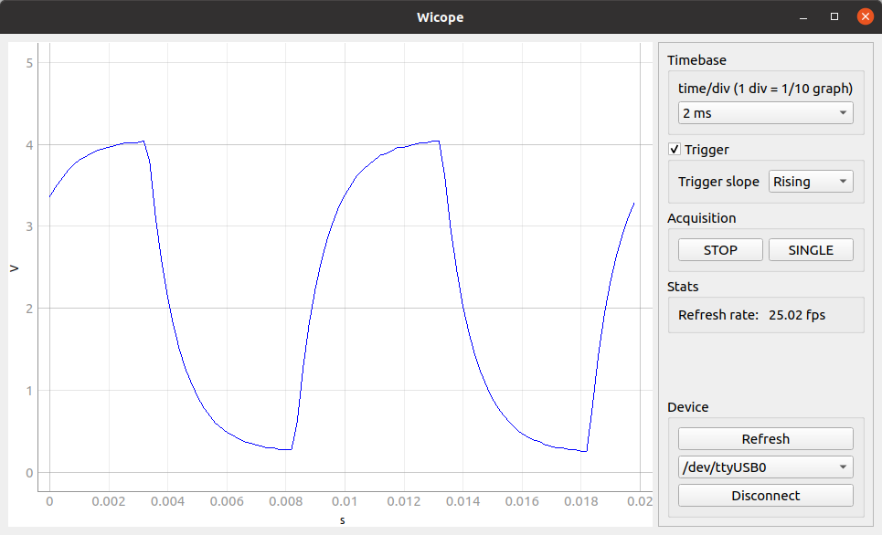
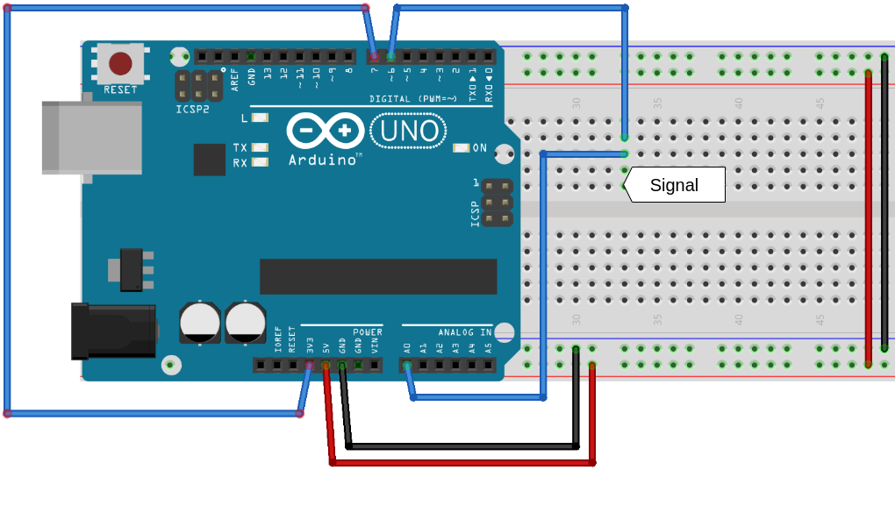
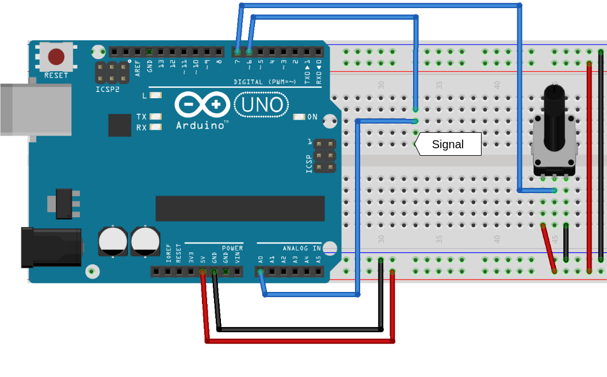

# Wicope
Wicope is a fast oscilloscope GUI application that makes use of Arduino to acquire signals.

This is not a professional oscilloscope, but it can be useful
for electronics enthusiasts and for education.



### Main features

This oscilloscope is compatible with Arduino boards based on the Atmega 328P microcontroller. These are mainly Arduino UNO and Arduino Nano. Although the limitations of this microcontroller, the oscilloscope is capable of:

- Acquire up to 100 kSamples/s
- Have a refresh rate up to 75 frames per second
- Use an external trigger

## Disclaimer

THE SOFTWARE IS PROVIDED "AS IS", WITHOUT WARRANTY OF ANY KIND, EXPRESS OR IMPLIED. IN NO EVENT SHALL THE AUTHORS OR COPYRIGHT HOLDERS BE LIABLE FOR ANY CLAIM, DAMAGES OR OTHER LIABILITY, ARISING FROM, OUT OF OR IN CONNECTION WITH THE SOFTWARE OR THE USE OR OTHER DEALINGS IN THE SOFTWARE.

Dealing with electronics can be dangerous if you do not know what you are doing and the authors cannot guarantee the correctiveness of the information provided here. 

You should double check what you are doing in order to avoid damaging equipment (including but not limited to computers, laptops, Arduinos...) or harming yourself or other people. Authors do not take any responsibility of any kind of damage.

Use the software, instructions and tutorials at your own risk.

Some general tips to avoid damage include:

- Only plug signals into the Arduino between 0 and 5 volts.
- Always use the same ground for Aruino and the circuit you are measuring. Do not connect the ground of the Arduino (which is connected to the ground of your computer) to any external device connected to mains.
- The safest thing is to only measure isolated circuits which are powered by the same Arduino used as oscilloscope.

## Installation and usage

#### 1. Install

First thing you need is to install `wicope`:

```bash
pip install wicope
```

You can also install the last development version with:

```bash
pip install git+https://github.com/diepala/wicope@master
```

#### 2. Load firmware to Arduino

Using the Arduino IDE, upload the file `firmware/firmware.ino` to your Arduino UNO / Nano board.

#### 3. Connections

Prepare your circuit to measure and make the necessary connections with the Arduino board. The pin uses of the Arduino are:

- Analog Pin 0 (PC0): Input signal
- Digital Pin 6 (PD6): Trigger signal
- Digital Pin 7 (PD7): Analog trigger threshold level

Most of the time you will want the trigger signal to be the same as the input signal. In this case connect digital pin 6 and analog pin 0 together.

When using trigger in the GUI, make sure to have a threshold set on digital pin 7 and that a signal triggers it on digital pin 6, otherwise the Arduino will be blocked until it gets a trigger.

If you want to use 3.3 V as a threshold level, just connect digital pin 7 to the Arduino 3.3 V pin.

An example schematic of the connections of the Arduino, with the trigger threshold set to 3.3 V, is:



You can also control the trigger threshold level using a potentiometer, as shown in the following example:



Finally connect the Arduino to your computer via USB.

#### 4. Use the Wicope App

To launch the app, in your terminal execute:

```bash
wicope
```

Click the `Refresh` button and select the port your Arduino is connected to. Then press `Connect` and wait a couple of seconds for the Arduino to reset.

You are ready to use the oscilloscope!

Click `RUN` for continuous acquisition or `SINGLE` for a single capture.

## Acknowledgements

Special thanks to [Caffeinomane](https://www.instructables.com/member/Caffeinomane/) for building [Girino - Fast Arduino Oscilloscope](https://www.instructables.com/Girino-Fast-Arduino-Oscilloscope/) which inspired to build this project. The firmware of this project is also based on Girino's firmware.
